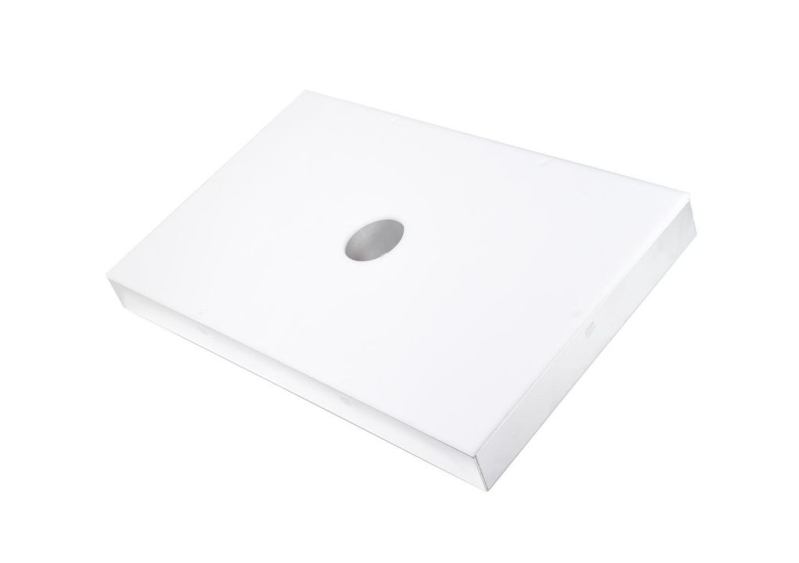
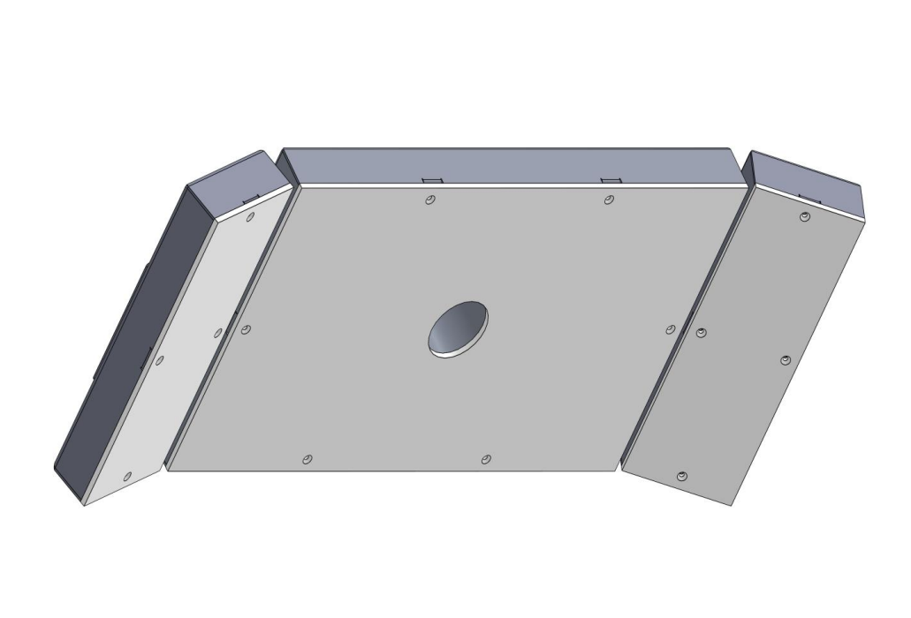
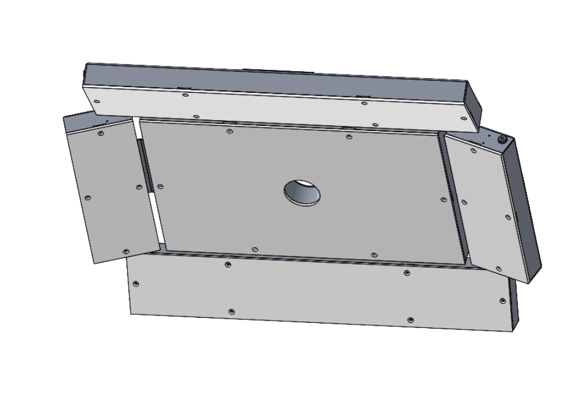
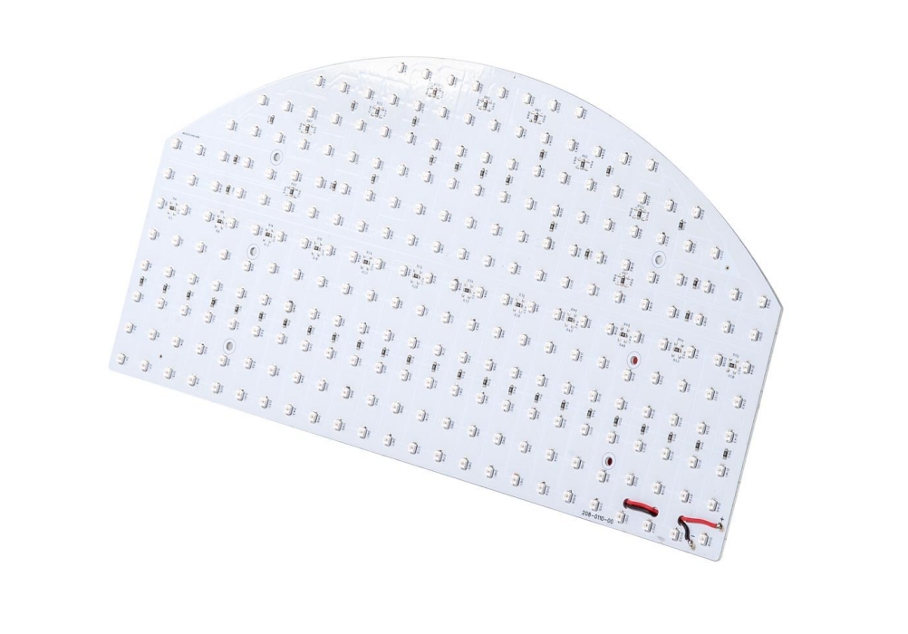
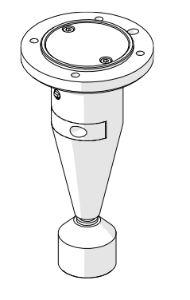

# **Opzioni**  
## Toplight  
descrizione funzionalità toplight

le taglie disponibili sono:
### TopLight per FB200/350/500
    
    
 

|  |  |  |  |
|--|--|--|--|
|items|GM000591|GM000592| GM000590|  
|led color|red|infrared|white|  
|Wavelength|630 nm|850 nm|N/A|  
|Voltage|24VDC|24VDC|24VDC|  
|current|1.8A|2.2A|2.2A|
|lighting area| 400x280 mm^2|
|housing material | Aluminium alloy 
| working temperature | -40 / + 85° C 
|cable length | 5 m |
| cooling method | natural air | 
| opaline material | opaline white methacrylate |
 

### TopLight XL per FB650/800
   
    
 

|  |  |  |  |
|--|--|--|--|
|items|GM000591|GM000592| GM000590|  
|led color|red|infrared|white|  
|Wavelength|630 nm|850 nm|N/A|  
|Voltage|24VDC|24VDC|24VDC|
|current|2.5A|2.7A|2.9A|
|lighting area| 700x280 mm^2|
|housing material | Aluminium alloy 
| working temperature | -40 / + 85° C 
|cable length | 5 m |
| cooling method | natural air | 
| opaline material | opaline white methacrylate |

### TopLight XXL per FB650/800
  
    

|  |  |  |  |
|--|--|--|--|
|items|GM000591|GM000592| GM000590|  
|led color|red|infrared|white|  
|Wavelength|630 nm|850 nm|N/A|  
|Voltage|24VDC|24VDC|24VDC|
|current|3.9A|4.5A|4.9A|
|lighting area| 700x500 mm^2|
|housing material | Aluminium alloy 
| working temperature | -40 / + 85° C 
|cable length | 5 m |
| cooling method | natural air | 
| opaline material | opaline white methacrylate |

## Backlight 
descrizione funzionalità backlight 

### Backlight per FB200

    

|items|CE000351|CE000353|CE000331| 
|--|--|--|--|
|led colour|red|infrared|white|  
|Wavelength|630 nm|850 nm|N/A|  
|Voltage|24VDC|24VDC|24VDC|
|current|0.17A|0.12A|0.17A|
|lighting area| 155x75 mm^2|
|housing material | Aluminium alloy 
| working temperature | -40 / + 85° C 
|cable length | 0.2 m |
| cooling method | natural air | 
| opaline material | opaline white methacrylate | 

### Backlight per FB350
   
    

|items|CE000342|CE000275|CE000341| 
|--|--|--|--| 
|led color|red|infrared|white|  
|Wavelength|630 nm|850 nm|N/A|  
|Voltage|24VDC|24VDC|24VDC|  
|current|0.18A|0.13A|0.18A|
|lighting area| 220x100 mm^2|
|housing material | Aluminium alloy |
| working temperature | -40 / + 85° C |
|cable length | 0.2 m |
| cooling method | natural air | 
| opaline material | opaline white methacrylate | 

### Backlight per FB500
   
    

|items|CE000344|CE000272|CE000343|
|--|--|--|--| 
|led color|red|infrared|white|  
|Wavelength|630 nm|850 nm|N/A|  
|Voltage|24VDC|24VDC|24VDC|
|current|0.46A|0.31A|0.46A|
|lighting area| 330x170 mm^2|
|housing material | Aluminium alloy |
| working temperature | -40 / + 85° C |
|cable length | 0.2 m |
| cooling method | natural air | 
| opaline material | opaline white methacrylate |

### Backlight per FB650
   
    

|items|CE000306|CE000273|CE000305|
|--|--|--|--|
|items|GM000591|GM000592| GM000590|  
|led color|red|infrared|white|  
|Wavelength|630 nm|850 nm|N/A|  
|Voltage|24VDC|24VDC|24VDC| 
|current|0.86A|0.56A|0.94A|
|lighting area| 400x240 mm^2|
|housing material | Aluminium alloy |
| working temperature | -40 / + 85° C |
|cable length | 0.2 m |
| cooling method | natural air | 
| opaline material | opaline white methacrylate |

### Backlight per FB800

    

|items|CE000345|CE000274|CE000346|
|--|--|--|--|
|led color|red|infrared|white|  
|Wavelength|630 nm|850 nm|N/A|  
|Voltage|24VDC|24VDC|24VDC| 
|current|1.15A|0.76A|1.2A|
|lighting area| 400x315 mm^2|
|housing material | Aluminium alloy |
| working temperature | -40 / + 85° C |
|cable length | 0.2 m |
| cooling method | natural air | 
| opaline material | opaline white methacrylate |

### Backlight per FB1200

    

|items|GE000051|GE000052|GE000050|
|--|--|--|--|
|led color|red|infrared|white|  
|Wavelength|630 nm|850 nm|N/A|  
|Voltage|24VDC|24VDC|24VDC| 
|current|4A|2.6A|4.2A|
|lighting area| 917x525 mm^2|
|housing material | Aluminium alloy |
| working temperature | -40 / + 85° C |
|cable length | 0.2 m |
| cooling method | natural air | 
| opaline material | opaline white methacrylate |

## Supporto per Camera e Toplight 
descrizione funzionalità 

|item | GM000632 |
| -- | -- | 
| compatibility | Camera and Toplight 200/350/500  Toplight XL 650/800  Toplight XXL 650/800 | 
| Vertical positioning range (camera bracket centre from base flange )| from 300 mm up to 1300 mm | 
| radial positioning range (camera bracket centre from pole center ) | frokm 150 mm up to 650 mm | 
| weight | 14 kg | 
| materials | stainless steel pole stand + aluminium profiles for toplight and camera supporting structure | 
| Fixation predisposition | N°4 M10 Screws on diameter D140mm | 

## Strumento Laser per Calibrazione 
Lo Strumento Laser è una soluzione avanzata per la calibrazione che migliora la precisione con cui viene salvato il punto di riferimento del robot.
Il beneficio principale del laser è che non richiede un contatto fisico con la griglia di calibrazione. Funzionando come un puntatore ad alta precisione, il laser consente all'operatore di allineare il punto target in modo visivo e ripetibile sulla griglia, offrendo un grado di accuratezza molto superiore rispetto all'uso di una punta fisica. 
Questa precisione è essenziale per il successo della calibrazione e si integra perfettamente con la ripetibilità garantita dalla Griglia di Calibrazione Dedicata ARS.

 

|Caratteristica	|Strumento Laser (Laser Tool)|	Strumento a Punta (Tip Tool) Standard |
|--|--|--|
|Metodo di Riferimento	|Non a contatto (puntatore visivo)	|A contatto (punta meccanica/fisica)|
|Precisione del Riferimento	|Massima precisione; l'operatore allinea visivamente il punto con accuratezza.	|Media, subordinata alla vista dell’operatore|
|Facilità d'Uso	|Semplifica la procedura di allineamento visivo.	|Richiede maggiore attenzione nel posizionamento e nell'evitare l'inclinazione.|
|Vantaggio Chiave	|Consente di salvare il punto di riferimento robot con la massima fedeltà possibile, essenziale per l'accuratezza finale del picking.|	Metodo base, ma meno preciso del laser.|

:::{admonition} Suggerimento 
:class: tip 
L'utilizzo dello Strumento Laser in combinazione con la Griglia di Calibrazione Dedicata ARS costituisce la metodologia più robusta e precisa per l'installazione del sistema FlexiVision
:::

## Switch 

## Display Touch Screen  

## Ring Light 