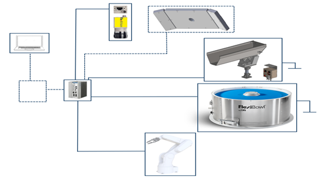

# **Cablaggio e Connessioni**
immagine panoramica connessione elettriche 
tipo:  


```{list-table} 
:header-rows: 1
:widths: 10 70 20

* - **Step**
  - **Azione**
  - **Immagine**

* - 1
  - Connect the power supply to the FlexiBowl® connection.  
    [🔗 Refer to manual for power supply specs](http://link-al-manuale.com)
  - (Immagine 1)

* - 2
  - Connect Ethernet cable to the FlexiBowl® Ethernet socket.
  - (Immagine 2)

* - 3
  - Connect the compressed air to the FlexiBowl® connection.  
    [🔗 Refer to manual for pneumatic specs](http://link-al-manuale.com)
  - (Immagine 3)

* - 4
  - Turn **ON** the FlexiBowl® AC switch (position "I"). The READY led is **ON**.
  - (Immagine 4)

* - 5
  - Connect the FlexiBowl® to the VisionController.
  - (Immagine 5)

* - 6
  - Connect the VisionController (PC) via the Ethernet connection.
  - (Immagine 6)

* - 7
  - Connect the camera (POE compatible). It must be connected to the VisionController.
  - (Immagine 7)
```