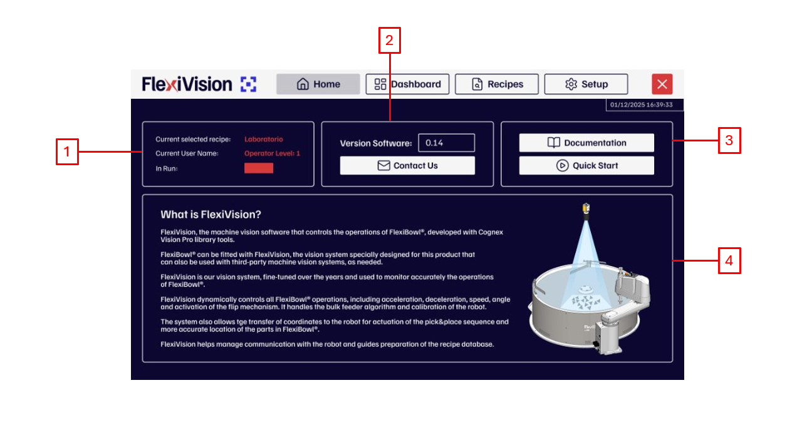
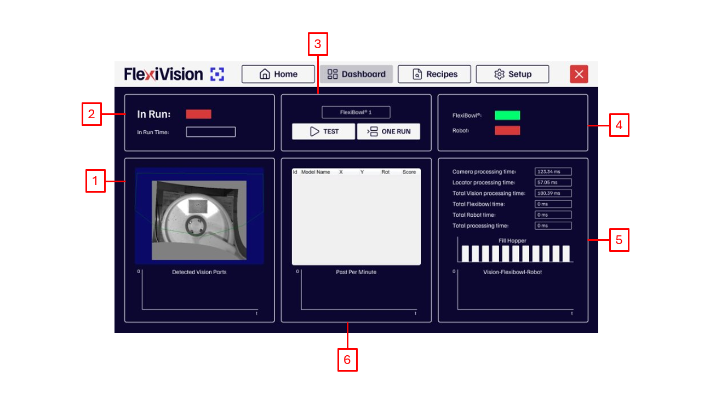
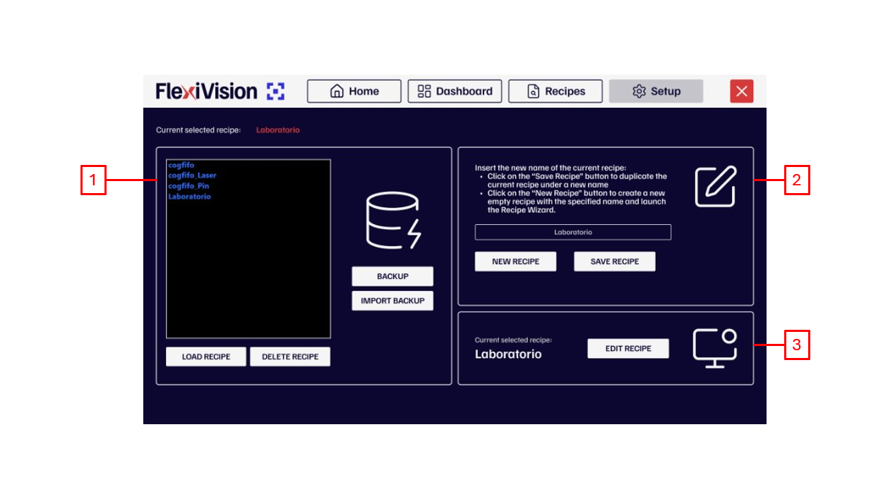
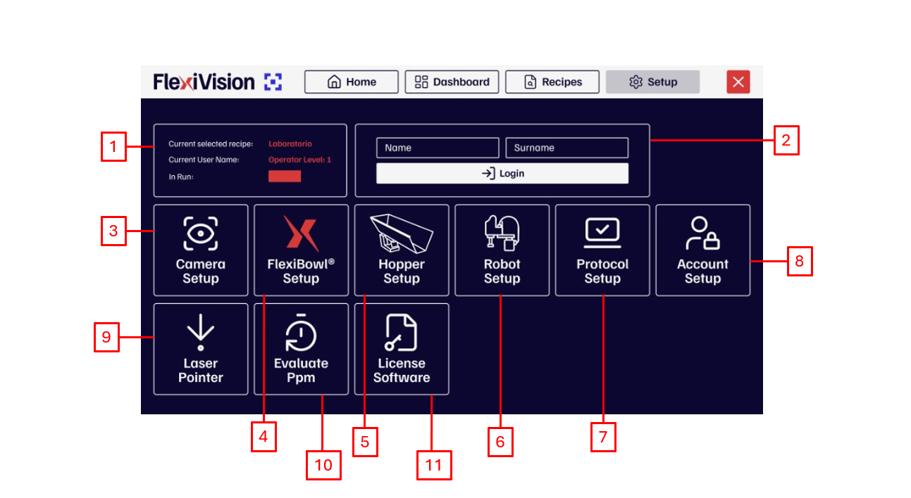

# **Panoramica dell'interfaccia**
descrizione generale interfaccia 
## Pagina Home  

|#|descrizione |
|--|--|
|1|riquadro in cui.. |  
|2|Riquadro in cui.. |
|3|Riquadro in cui..|  
|4|Riquadro in cui .. |
## Pagina DashBoard 

|#|descrizione |
|--|--|
|1|riquadro in cui.. |  
|2|Riquadro in cui.. |
|3|Riquadro in cui..|  
|4|Riquadro in cui .. |
|5|Riquadro in cui..|  
|6|Riquadro in cui .. |
## Pagina Recipes 

|#|descrizione |
|--|--|
|1|riquadro in cui.. |  
|2|Riquadro in cui.. |
|3|Riquadro in cui..|  

## Pagina Setup 

|#|descrizione |
|--|--|
|1|riquadro in cui.. |  
|2|Riquadro in cui.. |
|3|Riquadro in cui..|  
|4|Riquadro in cui .. |
|5|riquadro in cui.. |  
|6|Riquadro in cui.. |
|7|Riquadro in cui..|  
|8|Riquadro in cui .. |
|9|Riquadro in cui..|  
|10|Riquadro in cui .. |
|11|Riquadro in cui .. |
## i tasti INFO
