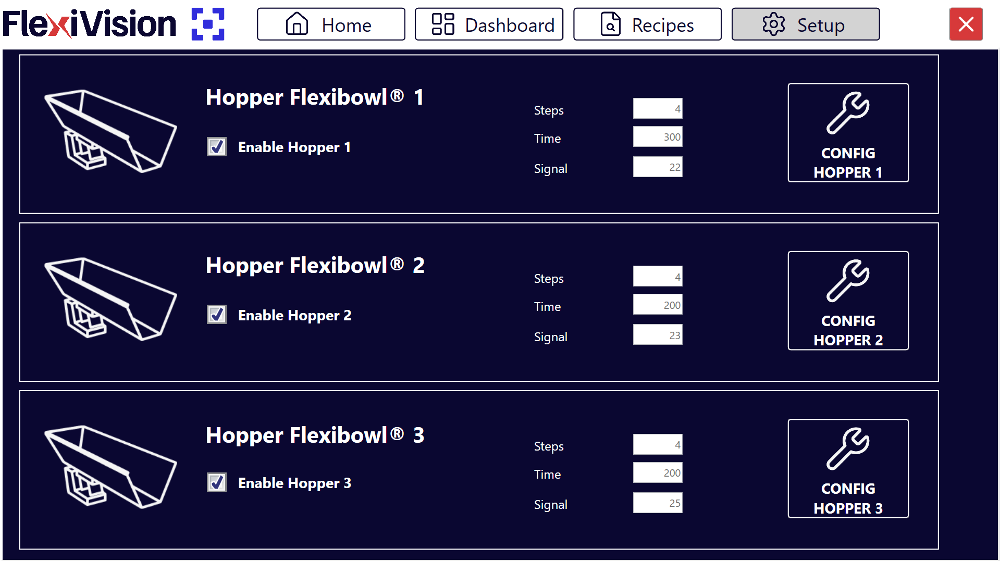
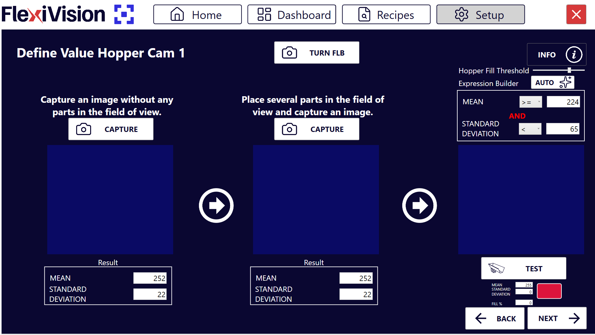

(confighopper)=
# **Configurazione della Tramoggia (Hopper)**

La configurazione della tramoggia permette di gestire il rifornimento automatico dei componenti sul disco del FlexiBowl®. Il sistema utilizza la visione artificiale per determinare quando il livello di riempimento è insufficiente e attivare la vibrazione di scarico.

## **Step 1: Accesso alla Configurazione**
```{list-table}
* - 1. 
  - Cliccare sulla sezione 
* - 2. 
  - Dalla sezione **Hopper Setup**, è possibile visualizzare e gestire le unità di carico collegate.
    
    :::{dropdown} Pagina Hopper Setup 
    
    :::
* - 3. 
  - Selezionare la casella **Enable Hopper X** per attivare la tramoggia corrispondente.
* - 4. 
  - Cliccare sul pulsante **Config Hopper X** per accedere alla configurazione specifica 
```
## **Step 2: Definizione dell'Area di Controllo**

In questa fase si definisce la porzione di disco che la telecamera deve monitorare per lo scarico.

```{list-table}
* - 5. 
  - Modificare il riquadro blu a schermo per inquadrare l'area in cui verranno rilevati i componenti.
   **Strumenti di supporto**:
      * **Info**: Cliccare per visualizzare dettagli sulle funzionalità della pagina.
      * **Expert**: Accesso a impostazioni avanzate.
```
``````{seealso}
  ```{dropdown} Video Tutorial Step 2: Definizione Area di Controllo

    :::{video} Nuovo_Modello/video/TastoInfo_AreaHopper_1280x720.mp4
    :width: 100%
    :align: center
    :::
  ```
``````

## **Step 3: Definizione dei Valori di Soglia**

```{list-table}
* - 6. 
  - Cliccare  per accedere alla pagina **Define Value Hopper Cam**, dove si istruisce il sistema a distinguere tra disco vuoto e disco pieno.
    :::{dropdown} Pagina Define Value Hopper Cam 
    
    :::
* - 7. 
  - Rimuovere tutti i componenti dall'area di visione e cliccare sul primo pulsante **CAPTURE**.
* - 8. 
  - Posizionare il numero minimo di componenti che si desidera mantenere sul disco. Se il numero scende sotto questa soglia, la tramoggia si attiverà.
* - 9. 
  - Cliccare sul secondo pulsante **CAPTURE**.
* - 10. 
  - Cliccando su  nell'Expression Builder, il sistema calcola automaticamente i valori di **Mean** (Media) e **Standard Deviation**.
* - 11. 
  - Rimuovere alcuni pezzi e cliccare su . 
* - 12. 
  - Osservare l'indicatore risultato:
    - **Verde** 🟢: Livello insufficiente, Hopper si attiva (scarico necessario)
    - **Rosso** 🔴: Livello sufficiente, Hopper NON si ATTIVA (OK)

      :::{warning}
      **Calibrazione insufficiente**

      Se il sistema non rileva correttamente il livello:

      **Problema: Sempre verde (attiva sempre Hopper)**
      → Soglia troppo bassa o interferenze nell'area
      → Soluzione: Aumentare numero pezzi nella seconda acquisizione, verificare pulizia area

      **Problema: Sempre rosso (non attiva mai Hopper)**
      → Soglia troppo alta o area monitoraggio non rappresentativa
      → Soluzione: Ridurre numero pezzi nella seconda acquisizione CAPTURE, ripetere AUTO

      **Problema: Comportamento errato (alterna verde/rosso casualmente)**
      → Illuminazione instabile o area troppo piccola
      → Soluzione: Verificare backlight stabile, ingrandire area monitoraggio, ripetere calibrazione
      :::
```
``````{seealso}
  ```{dropdown} Video Tutorial Step 3: Definizione Valori di Soglia

    :::{video} Nuovo_Modello/video/TastoInfo_Hopper_1280x720.mp4
    :width: 100%
    :align: center
    :::
  ```
``````

```{note}  
**Fill Hopper Threshold** = ... 
```
## **Step 4: Parametri Operativi**

Tornare alla schermata principale di Hopper Setup per definire il comportamento meccanico.


```{list-table} Parametri di Funzionamento
:widths: 20 80
:header-rows: 1

* - **Parametro**
  - **Descrizione e Procedura**
* - **Steps**
  - Numero di sequenze necessarie per portare i pezzi dallo scarico all'area di prelievo.

    :::{note}
    **Come calcolarlo:**

    :::::{list-table}

    * - 1.
      - Svuotare completamente il disco FlexiBowl
    * - 2.
      - Attivare manualmente lo scarico Hopper (i pezzi cadono sul disco)
    * - 3.
      - Eseguire una sequenza FlexiBowl
    * - 4.
      - Contare quanti cicli servono perché i primi pezzi tornino nell'area di scarico della tramoggia
    * - 5.
      - Questo numero è il valore da inserire in **Steps**
    :::::
    :::

* - **Time**
  - Millisecondi di vibrazione della tramoggia. Valore consigliato: **100 – 1000 ms** (Media: **500 ms**). Regolare di ±100 ms in base al flusso desiderato.
```

```{tip}
   Il tempo di vibrazione dipende non solo dal valore impostato, ma anche dal volume di componenti attualmente presenti nella vasca della tramoggia. È essenziale mantenere un carico costante per un flusso uniforme.
```
```{tip}
**Fattori che influenzano il Time**

Il tempo di vibrazione efficace dipende da:

**Volume Hopper**:
- Hopper pieno: Maggiore pressione, più pezzi per ms
- Hopper semivuoto: Minore pressione, meno pezzi per ms
- **Best practice**: Mantenere Hopper costantemente >50% pieno per flusso uniforme

**Tipo di pezzo**:
- Pezzi scorrevoli (cilindri lisci): Scorrono facilmente, Time più breve
- Pezzi che si incastrano: Scorrono lentamente, Time più lungo

**Angolo scarico Hopper**:
- Angolo ripido: Scarico rapido, Time breve
- Angolo dolce: Scarico lento, Time lungo

**Manutenzione**:
- Superficie interna pulita: Flusso ottimale
- Superficie con residui/usura: Flusso ridotto → Incrementare Time
```

```{important}
   **Salvataggio della Ricetta**: Al termine di ogni blocco di modifiche, è fondamentale **Salvare la Ricetta**. Ogni variazione apportata viene memorizzata solo se la ricetta viene salvata correttamente prima di uscire o cambiare pagina.
```

## Salvataggio Configurazione

```{warning}
**Salvataggio ricetta obbligatorio**

Al termine della configurazione Hopper:

  :::{list-table}
    * - 1. 
      - Verificare che tutti i parametri siano configurati correttamente:
        - Area monitoraggio posizionata
        - Soglie calibrate (TEST funzionante)
        - Steps e Time impostati
    * - 2. 
      - Tornare alla pagina principale 
    * - 3. 
      - Cliccare su 
    * - 4. 
      - Confermare il salvataggio
  :::
**IMPORTANTE**: Ogni variazione apportata viene memorizzata **SOLO** se la ricetta viene salvata correttamente prima di uscire o cambiare pagina.

Senza salvataggio, tutte le configurazioni Hopper verranno perse!
```

---

## Troubleshooting Hopper

### Problemi comuni e soluzioni

```{warning}
**Hopper non si attiva mai**

**Sintomi**: Disco si svuota ma Hopper non scarica

**Cause possibili:**
- Soglia configurata troppo bassa (sistema pensa sia sempre pieno)
- Area monitoraggio mal posizionata (non rappresentativa)
- Enable Hopper disabilitato

**Soluzioni:**
1. Verificare Enable Hopper attivo
2. Ripetere calibrazione soglie con più pezzi nella seconda acquisizione
3. Spostare area monitoraggio in zona più rappresentativa
4. Eseguire TEST manualmente per verificare trigger
```

```{warning}
**Hopper si attiva troppo frequentemente**

**Sintomi**: Hopper scarica continuamente, disco si riempie eccessivamente

**Cause possibili:**
- Soglia configurata troppo alta
- Time di scarico troppo lungo
- Area monitoraggio in zona sempre vuota

**Soluzioni:**
1. Ridurre soglia (meno pezzi nella seconda acquisizione CAPTURE)
2. Ridurre Time (durata vibrazione) di 100-200 ms
3. Verificare posizionamento area monitoraggio
```

```{warning}
**Pezzi scaricati non arrivano in tempo**

**Sintomi**: Robot trova disco vuoto subito dopo attivazione Hopper

**Cause possibili:**
- Steps troppo pochi (pezzi non hanno tempo di arrivare)
- Sequenze FlexiBowl non efficaci
- Ostruzione percorso scarico

**Soluzioni:**
1. Aumentare Steps di 1-2 unità
2. Verificare parametri Config FlexiBowl (velocità, angolo)
3. Ispezionare fisicamente percorso scarico Hopper → Disco
```

---

## Manutenzione Hopper

### Operazioni periodiche

```{tip}
**Manutenzione preventiva**

Per garantire funzionamento ottimale:

**Settimanale:**
- Controllare livello riempimento fisico Hopper
- Verificare pulizia superficie interna
- Controllare connessione aria compressa (se pneumatico)

**Mensile:**
- Pulire superficie interna Hopper
- Verificare usura componenti vibranti
- Controllare fissaggi meccanici

**Trimestrale:**
- Ripetere calibrazione soglie (l'usura può alterare i parametri)
- Verificare portata scarico (può ridursi con usura)
- Controllare tubazioni aria compressa

**Best practice:**
- Tenere Hopper sempre >30% pieno per flusso costante
- Non riempire Hopper oltre 90% (rischio ostruzione scarico)
- Annotare frequenza riempimento Hopper per pianificare rifornimenti
```

---

## Prossimi Passi

Una volta completata la configurazione dell'Hopper, procedere con:

**→ [Verifica Risultati e Dashboard](24_Verifica_Risultati.md)** - Monitoraggio applicazione completa in produzione

```{tip}
**Sistema completo operativo**

Congratulazioni! Con la configurazione Hopper completata, il sistema FlexiVision One è completamente configurato e pronto per l'uso produttivo:

- ✓ Modelli pezzo creati e ottimizzati
- ✓ FlexiBowl configurato per movimentazione ottimale
- ✓ Hopper configurato per rifornimento automatico
- ✓ Sistema completamente autonomo

Il sistema ora può operare continuamente con intervento operatore minimo (solo per ricaricare Hopper quando si svuota fisicamente).

Procedere con il monitoraggio in produzione per validare le configurazioni e ottimizzare ulteriormente se necessario.
```
