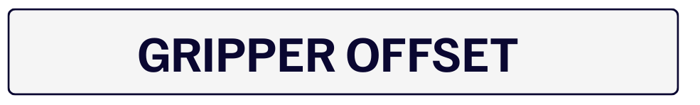
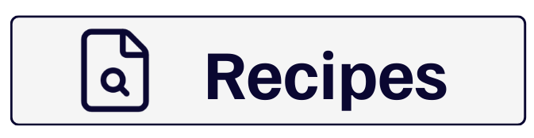
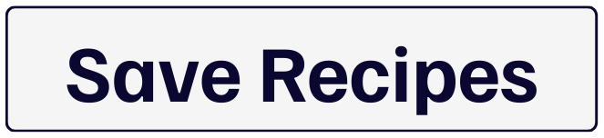

(robotpick)=
# **Calibrazione Robot Pick**
In questa pagina vedremo come collegare le coordinate della visione con quelle del robot per consentire un prelievo preciso dei componenti.


## Cos'è il Robot Pick?

La funzione **Robot Pick** calcola l'offset tra le coordinate rilevate da FlexiVision e le coordinate reali del robot, permettendo al robot di prelevare i componenti nella posizione corretta.

```{danger}
**Coordinate robot fondamentali!**

Questa fase richiede **OBBLIGATORIAMENTE** le coordinate X, Y, Rz salvate durante la preparazione fisica del setup (Step 1 della sezione Clearances).

Senza queste coordinate, non è possibile completare la calibrazione. Se sono state perse o dimenticate, sarà necessario ripetere l'intera preparazione fisica con il robot.
```
---

## Panoramica Interfaccia Robot Pick

Dopo aver cliccato "Next" nella pagina Clearances, si apre la pagina **Robot Model Pick**.

## Parametri Principali

|Sezione | Parametro | Funzione |
|-----------|-----------|----------|
| Enable | **Enable Robot Pick** | Attiva la calibrazione del robot |
|Vision Result| **X cord** | Coordinata X rilevata dalla visione |
|Vision Result| **Y cord** | Coordinata Y rilevata dalla visione |
|Vision Result| **RZ cord** | Rotazione Z rilevata dalla visione |
|Insert Robot Coordinate| **X cord** | Coordinata X del robot (da inserire) |
|Insert Robot Coordinate| **Y cord** | Coordinata Y del robot (da inserire) |
|Insert Robot Coordinate| **RZ cord** | Rotazione Z del robot (da inserire) |


| Funzione | Descrizione |
|----------|-------------|
| **Find Object** | Rileva il componente e mostra coordinate visione |
| **Gripper Offset** | Calcola l'offset per il prelievo corretto |

---

## **Step 1: Attivazione e Rilevamento Componente**

```{list-table}
* - 1. 
  - Cliccare su **Enable Robot Pick**
* - 2. 
  - Cliccare su :
      - Il sistema rileverà il componente di riferimento
      - Le coordinate appariranno nella sezione **Vision Result**

      :::{note} Vision Result
      Queste sono le coordinate che FlexiVision "vede" nell'immagine. Non sono ancora collegate al sistema di coordinate del robot.
      :::
```

## **Step 2: Inserimento Coordinate Robot e calcolo Offset**

```{list-table}
* - 3. 
  - Nel riquadro **Insert Robot Coordinates**, inserire le coordinate salvate durante la creazione del modello:
      - **X cord** → Coordinata X annotata al punto 8 della [Creazione Modello](nuovomodello)
      - **Y cord** → Coordinata Y annotata al punto 8 della [Creazione Modello](nuovomodello)
      - **RZ cord** → Rotazione Z annotata al punto 8 della [Creazione Modello](nuovomodello)

      :::{danger}
      Usa le coordinate salvate durante il setup del modello. Senza queste coordinate, la calibrazione sarà errata!  
      Le coordinate devono essere inserite con **massima precisione**:
      - Copiare i valori esattamente come annotati (inclusi decimali)
      - **NON approssimare** (es: 450.23 ≠ 450.2 ≠ 450)
      - Verificare di non aver scambiato X e Y
      - Controllare il segno (+ o -) di ciascuna coordinata

      **Errori in questa fase causano offset robot completamente errati**, risultando in tentativi di prelievo in posizioni sbagliate (anche decine di centimetri di errore).  
      :::
* - 4. 
  - Cliccare su 
      - Il sistema calcolerà automaticamente la trasformazione tra coordinate visione e coordinate robot
      - Questo offset verrà applicato a tutti i futuri rilevamenti
```
---

```{admonition} **Come Funziona il Gripper Offset?**
:class: info
Il sistema confronta:
- **Coordinate Visione**: dove FlexiVision "vede" il componente
- **Coordinate Robot**: dove il robot ha effettivamente afferrato il componente

Calcola la differenza e la memorizza come **offset**. Questo offset verrà applicato a tutti i componenti rilevati in futuro, garantendo che il robot prelevi sempre nella posizione corretta.

### Esempio Pratico

Vision Result:        X=100, Y=200, RZ=0°
Robot Coordinate:     X=350, Y=450, RZ=0°
Gripper Offset:       ΔX=+250, ΔY=+250, ΔRZ=0°

Quando FlexiVision rileva un nuovo componente a X=120, Y=220
Il robot andrà a prelevarlo a X=370, Y=470
```

---

## **Step 3: Finalizzazione e Salvataggio**

```{list-table}
* - 5. 
  - Cliccando su , torneremo alla pagina delle ricette 
* - 6. 
  - Cliccare su  per salvare l'intera configurazione

      :::{admonition} Salvataggio Completo
      :class: success
      Il salvataggio include:
      - ✓ Modello creato
      - ✓ Area di lavoro (ROI)
      - ✓ Tolleranze (Accept Threshold)
      - ✓ Istogrammi configurati
      - ✓ Calibrazione robot (Gripper Offset)
      :::
```

---

## Modelli Multipli - Aggiungere Altri Modelli

### **Step 4: Modelli Aggiuntivi (opzionale)**

```{list-table}
* - 7. 
  - Per creare altri modelli nella stessa ricetta:
      - Tornare su 
      - Selezionare un nuovo modello non ancora configurato 
      - Ripetere l'intera procedura dalla [Creazione Modello](nuovomodello)

      :::{tip}
      Ogni modello nella ricetta può avere configurazioni diverse (ROI, istogrammi, offset), permettendo di gestire componenti con caratteristiche diverse nella stessa applicazione.
      :::
```

---

## Verifica Finale

Prima di considerare la ricetta completata, continua con :

- [Configurazione del FlexiBowl ](configfb)
- [Configurazione della Tramoggia ](confighopper)
- [Monitoraggio Applicazione ](dashboard)

```{seealso}
- [Troubleshooting](troubleshooting)
```

---

```{toctree}  
21b_Expert.md
```
[Back To Top]()