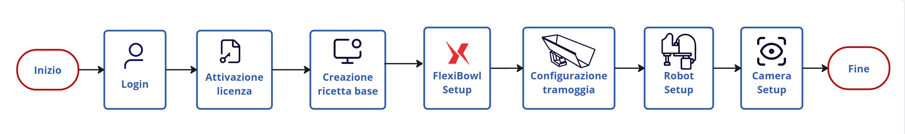
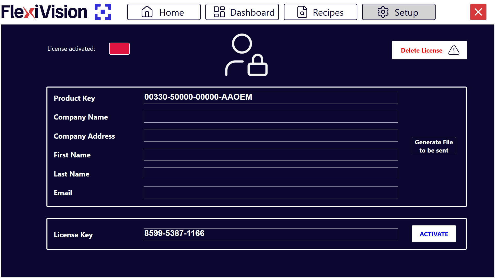

(setupcomponenti)=
# **Configurazione Iniziale del Sistema**

Questa sezione guida l'utente attraverso la configurazione completa dei componenti hardware e software del sistema FlexiVision One. È fondamentale seguire i passaggi nell'ordine indicato per garantire il corretto funzionamento del sistema.

```{note}
**Prerequisiti**

Prima di iniziare la configurazione software, assicurarsi che:
- L'installazione meccanica di tutti i componenti sia completata ([Installazione Meccanica](Installazione_Meccanica))
- Tutti i cavi siano collegati correttamente ([Cablaggio e Connessioni](cablaggio)) 
```

---

## Panoramica del processo di setup

Il processo di configurazione iniziale è composto da sette passaggi principali:

1. **Login** - Accesso al software con credenziali utente
2. **Attivazione licenza** - Inserimento della chiave di licenza (se non già attiva)
3. **Creazione ricetta base** - Configurazione del profilo applicativo
4. **FlexiBowl Setup** - Connessione e configurazione del FlexiBowl
5. **Hopper Setup**  - Configurazione della tramoggia 
6. **Robot Setup** - Configurazione comunicazione con il robot
7. **Camera Setup** - Configurazione della camera



```{warning}
**Ordine dei passaggi**

L'ordine dei setup è importante! Non saltare passaggi o modificare la sequenza, poiché alcune configurazioni dipendono da quelle precedenti.
```

---

## Operazioni preliminari

Il primissimo passo prima dell'avvio del software FlexiVision One è inserire la chiave di licenza fornita con il kit. 

### Passo 1: Login al sistema

All'avvio del software FlexiVision One, viene presentata la pagina Home. 
```{list-table} 
   :widths: 10 90
   :header-rows: 0
   * - **0**
     - Cliccare su Setup 
   * - **1**
     - **Selezionare l'utente ARS** dal menu a tendina in alto a destra.
   * - **2**
     - **Inserire la password** ArS2025.
       *(Nota: il campo è case-sensitive)*.
   * - **3**
     - Cliccare sul pulsante **LOGIN** per accedere all'interfaccia.
```

```{tip}
**Gestione utenti**

FlexiVision One supporta profili utente multipli con diversi livelli di permessi:
- **ARS**
- **Engineer**
- **Technician**
- **Operator**
```

---

### Passo 2: Attivazione licenza software

Dopo il primo login, se è necessario attivare la licenza FlexiVision, seguire questi passi: 

```{list-table}
:header-rows: 0
:widths: 10 90


* - **4**
  - Accedere alla sezione  e cliccare su **Software License**
    ```{dropdown} Pagina Software License 
       
    ```

* - **5**
  - Inserire la chiave di licenza fornita da ARS Automation nel campo dedicato.  
    La chiave è composta da caratteri numerici (es: ``XXXX-XXXX-XXXX-XXXX``).  
    :::{tip}
     Copiare e incollare la chiave per evitare errori di digitazione.
    :::
* - **6**
  - Cliccare su **Activate**

* - **7**
  - Attendere che l'indicatore di stato "License activated" diventi verde
```

```{warning}
**Chiave di licenza non valida**

Se la licenza non viene accettata:
- Verificare di aver inserito la chiave corretta 
- Assicurarsi che il VisionController sia connesso a Internet (alcune licenze richiedono validazione online)
- Contattare il supporto ARS se il problema persiste
```

---
(ricettabase)=
### Passo 3: Creazione ricetta base

Prima di configurare i componenti hardware, è necessario creare una ricetta di base che definisca i parametri del sistema.

````{list-table}
:header-rows: 0
:widths: 10 90

* - **8**
  - Accedere alla sezione |tasto_recipes| dal pulsante in alto

* - **9**
  - Inserire il nome della ricetta.

    Utilizzare un nome descrittivo (es: "Ricetta_Base").

    Evitare caratteri speciali o spazi (usare underscore ``_`` al posto degli spazi).

* - **10**
  - Cliccare su **New Recipe**

* - **11**
  - Selezionare il **FlexiBowl** utilizzato
    :::{note}
    Per comodità e coerenza, al primo avvio selezionare il FlexiBowl 1.
    :::

* - **12**
  - Cliccare su **Save Recipe** per salvare la ricetta

* - **13**
  - Cliccare nuovamente sul pulsante |tasto_recipes|
````

```{tip}
**Organizzazione ricette**

FlexiVision One permette di creare ricette multiple per diversi tipi di pezzi o configurazioni. Convenzioni consigliate:

- Utilizzare nomi che identificano chiaramente il pezzo (es: "Vite_M6_Zincata")

Per maggiori dettagli sulla gestione ricette, consultare la sezione [Creare una nuova ricetta](nuovaricetta).
```

---

## Configurazione componenti hardware

Una volta completate le operazioni preliminari, procedere con la configurazione dei componenti hardware nell'ordine seguente.

Tutti i setup hardware sono accessibili dalla pagina centrale **SETUP** del software.


```{list-table} 
* - **14** 
  - Dal menu principale, cliccare su 
* - **15** 
  - Vengono visualizzate le icone dei diversi componenti da configurare
* - **16**
  - Cliccare sull'icona del componente desiderato per accedere alla sua configurazione specifica
```

### Sequenza setup consigliata

```{list-table}
:header-rows: 1
:widths: 15 35 50

* - Passo
  - Componente
  - Descrizione
* - **4**
  - [FlexiBowl Setup](fbsetup)
  - Connessione e test comunicazione con FlexiBowl
* - **5**
  - [Hopper Setup](hoppersetup)
  - Configurazione tramoggia esterna se presente
* - **6**
  - [Robot Setup](robotsetup)
  - Configurazione porta TCP/IP e test comunicazione con il robot
* - **7**
  - [Camera Setup](camerasetup)
  - Configurazione acquisizione immagini e test camera
```

```{warning}
**Importanza della sequenza**

Seguire l'ordine indicato è importante perché la camera ha bisogno che il FlexiBowl sia configurato per testare l'illuminazione e  alcuni parametri dipendono dalle configurazioni precedenti
```
---

```{toctree}
:hidden:
13a_FB_Setup.md
13b_Hopper_Setup.md
13c_Robot_Setup.md
13d_Camera_Setup.md
```