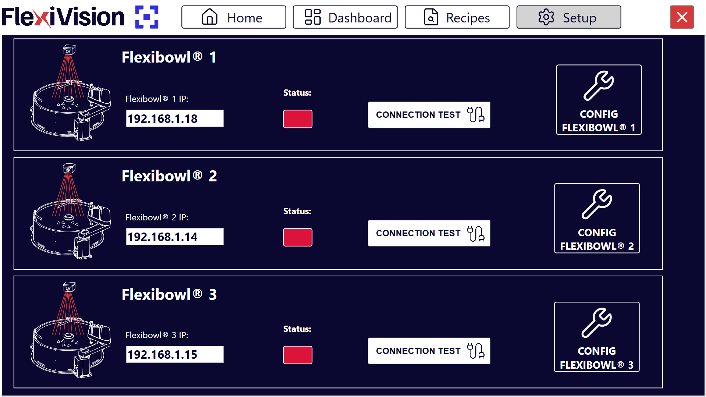
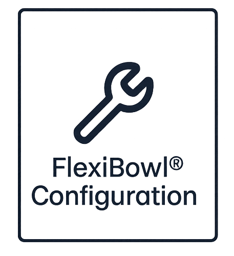

# **Passo 4: FlexiBowl Setup**

Questa sezione descrive la procedura per connettere e configurare il FlexiBowl (alimentatore vibrante) con il sistema FlexiVision Easy.

```{note}

Prima di procedere, assicurarsi che:
- Il FlexiBowl sia stato installato meccanicamente e collegato elettricamente
- Il cavo Ethernet dal FlexiBowl sia connesso alla rete
- L'indirizzo IP del FlexiBowl sia noto (verificare etichetta sul dispositivo o documentazione)
- La ricetta base sia stata creata (Passo 3)
```

---

## Accesso alla configurazione FlexiBowl
```{list-table}
* - 1. 
  - Dalla pagina principale del software, cliccare su 
* - 2. 
  - Nella pagina SETUP, identificare e cliccare sull'icona **FlexiBowl Setup**
    ```{dropdown} Pagina Setup 
       
    ```
* - 3. 
  - Si apre la schermata di configurazione del FlexiBowl
```

---

## Procedura di connessione

### **Step 1: Configurazione indirizzo di rete**

```{list-table}
* - 1. 
  - Nel campo **FlexiBowl IP**, inserire l'indirizzo IP del FlexiBowl
      - Formato: `192.168.1.XXX` (o secondo la configurazione della vostra rete)
      - L'indirizzo IP del FlexiBowl è riportato su un'etichetta sul dispositivo
* - 2. 
  - Verificare che l'indirizzo sia sulla stessa subnet del VisionController
```

### **Step 2: Test di connessione**

```{list-table}
:widths: 5 95

* - **1.**
  - Dopo aver inserito l'IP, cliccare sul pulsante **Connection Test**

* - **2.**
  - Il sistema esegue un test di comunicazione (ping) verso il FlexiBowl

* - **3.**
  - Osservare l'indicatore di **Status**:
    - 🟢 **Verde**: Connessione stabilita correttamente
    - 🔴 **Rosso**: Connessione fallita (verificare IP e cablaggio)
```

```{warning}
**Connessione fallita**

Se l'indicatore rimane rosso o appare un messaggio di errore:

1. Verificare che l'indirizzo IP inserito sia corretto
2. Controllare fisicamente il cavo Ethernet (deve essere inserito completamente)
3. Verificare che lo switch/router di rete sia acceso
4. Assicurarsi che FlexiBowl e VisionController siano sulla stessa subnet
5. Provare a pingare il FlexiBowl da terminale Windows:
   - Aprire Prompt dei comandi
   - Digitare: `ping 192.168.1.XXX` (sostituire con IP effettivo)
   - Se il ping fallisce, problema di rete; se ha successo, problema software

Se il problema persiste, consultare [Troubleshooting](../26_trb_shooting_guide.md).
```

---

## Configurazione parametri FlexiBowl

Una volta stabilita la connessione, procedere con la configurazione dei parametri operativi.

### **Step 3: Accesso configurazione**

```{list-table}
* - 1. 
  - Cliccare sul pulsante 
* - 2. 
  - Si apre una finestra con i parametri configurabili del FlexiBowl
```

### **Step 4: Abilitazione illuminazione (Backlight)**

```{list-table}
* - 1. 
  - Nella finestra di configurazione, localizzare il controllo **Backlight** 
* - 2. 
  - Attivare l'interruttore portandolo su **ON**
* - 3. 
  - Verificare visivamente che l'illuminazione del FlexiBowl si accenda: sul pannello di controllo del FlexiBowl la spia "light on" deve risultare verde 
```

### **Step 5: Sincronizzazione parametri**

```{list-table}

* - 1.
  - Cliccare su **Synchronize Parameters**
* - 2.
  - Questa operazione:

    - Invia i parametri dal VisionController al FlexiBowl
    - Salva la configurazione nella memoria del FlexiBowl
    - Sincronizza lo stato tra software e hardware
* - 3.
  - Attendere la conferma di sincronizzazione completata
```

```{warning}
**Non saltare la sincronizzazione**

È fondamentale cliccare su **Synchronize Parameters** dopo ogni modifica. Senza questo passaggio:
- Le modifiche non vengono applicate al FlexiBowl fisico
- Il sistema potrebbe comportarsi in modo incoerente
- Le impostazioni non vengono salvate permanentemente
```

### **Step 6: Completamento setup FlexiBowl**

```{list-table}
* - 1. 
  - Verificare che tutti i parametri siano configurati correttamente
* - 2. 
  - Assicurarsi di aver cliccato **Synchronize Parameters**
* - 3. 
  - Tornare alla pagina SETUP principale per procedere con il setup successivo
* - 4. 
  - Le impostazioni del FlexiBowl sono ora salvate nella ricetta attiva
```

---

## Problemi comuni e soluzioni

### FlexiBowl non vibra

```{warning} non per questa fase ma utile?
**Vibrazione non funzionante**

Se il FlexiBowl non vibra dopo l'attivazione:
- Verificare l'alimentazione elettrica del FlexiBowl (LED di stato sul dispositivo)
- Controllare che l'interruttore principale del FlexiBowl sia su ON
- Verificare il cablaggio dell'alimentazione
- Consultare il manuale del FlexiBowl per diagnostica specifica
```

### Illuminazione non uniforme

```{tip} non in questa fase ma utile?
**Ottimizzazione illuminazione**

Se l'illuminazione presenta zone più scure o più chiare:
- Verificare che backlight/toplight sia montato correttamente
- Pulire la superficie del piatto e dell'illuminatore
- Regolare l'intensità luminosa (parametro disponibile in configurazione avanzata)
- Verificare che non ci siano ostruzioni tra luce e superficie
```

---

## Passi successivi

Una volta completato il FlexiBowl Setup, procedere con:

- [Passo 5: Hopper Setup](13b_Hopper_Setup.md)
- [Passo 6: Robot Setup](13c_Robot_Setup.md)

