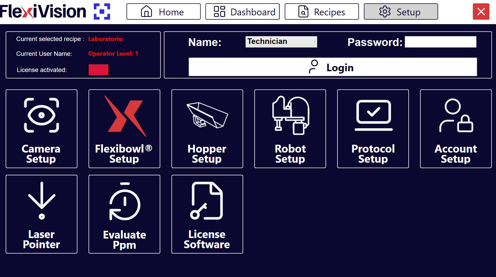

(hoppersetup)=
# **Passo 5: Hopper Setup**

Questa sezione descrive la procedura per configurare la tramoggia esterna (Hopper). L'Hopper è il componente che alimenta automaticamente pezzi sul FlexiBowl quando il livello scende sotto una soglia minima.

```{note}
**Prerequisiti**

Prima di procedere, assicurarsi che:
- L'Hopper sia stata installata meccanicamente sopra il FlexiBowl
- I collegamenti elettrici siano stati completati (segnali di controllo e alimentazione)
- Il FlexiBowl sia già connesso
```
---

## Accesso alla configurazione Hopper

```{list-table}
* - **1** 
  - Dalla pagina principale del software, cliccare su 
* - **2**
  - Nella pagina SETUP, identificare e cliccare sull'icona **Hopper Setup**
    ```{dropdown} Pagina Setup 
       
    ```
* - **3** 
  - Si apre la pagina di configurazione dell'Hopper
```

---

## Panoramica interfaccia Hopper Setup

La pagina Hopper Setup presenta diverse sezioni per la configurazione dei parametri operativi:


```{list-table}
:header-rows: 1
:widths: 30 70

* - Sezione
  - Descrizione
* - **Enable Hopper**
  - Interruttore per abilitare/disabilitare l'utilizzo dell'Hopper nel sistema
* - **Steps**
  - Numero di sequenze necessarie con cui il FlexiBowl arriva sotto l'area di scarico della tramoggia
* - **Time**
  - Durata dell'attivazione del segnale in millisecondi
* - **Signal**
  - Numero del segnale digitale utilizzato per controllare l'Hopper
* - **Config Hopper**
  - Pulsante per configurare la tramoggia (da utilizzare in seguito)
```
---

## Procedura di configurazione

```{list-table}
:widths: 10 30 70 
* - Step 1
  - Abilitazione Hopper 
  - Spuntare la checkbox **Enable Hopper**
* - Step 2
  - Configurazione Signal 
  - Nel campo **Signal**, inserire il numero del segnale digitale (DO - Digital Output) utilizzato per controllare l'Hopper
* - Step 3
  - Salvataggio e Completamento 
  - Tornare alla pagina  principale per procedere con il setup successivo
```

```{important}

Abilitare l'Hopper solo se:
- Il dispositivo è fisicamente presente e installato
- I collegamenti elettrici sono stati verificati
```

```{warning}
**Verifica cablaggio**

È fondamentale inserire il numero di segnale corretto corrispondente al cablaggio fisico:
- Un numero errato attiverà il segnale sbagliato (potenzialmente pericoloso)
- Consultare lo schema elettrico realizzato durante l'installazione
- In caso di dubbio, contattare chi ha effettuato il cablaggio
```

```{tip}
**Ottimizzazione futura**

I parametri impostati in questa fase sono sufficienti per la configurazione iniziale del sistema.
Durante la procedura andremo poi a definire gli altri aspetti della configurazione della tramoggia.
```


## Problemi comuni e soluzioni

### Hopper non si attiva

```{warning}
**Diagnosi mancata attivazione**

Se l'Hopper non si attiva:

1. Verificare che in **Enable Hopper** sia presente la spunta
2. Controllare il cablaggio elettrico del segnale digitale
3. Verificare che il numero **Signal** corrisponda al DO fisicamente connesso
4. Controllare l'alimentazione dell'Hopper 
5. Testare il segnale digitale con un multimetro (presenza tensione quando attivato)
6. Consultare il manuale dell'Hopper per verifiche specifiche del dispositivo
```

---

## Passi successivi

Una volta completato l'Hopper Setup (o saltato se non presente), procedere con:

**[Passo 6: Robot Setup](13c_Robot_Setup.md)** - Configurazione comunicazione con il robot

