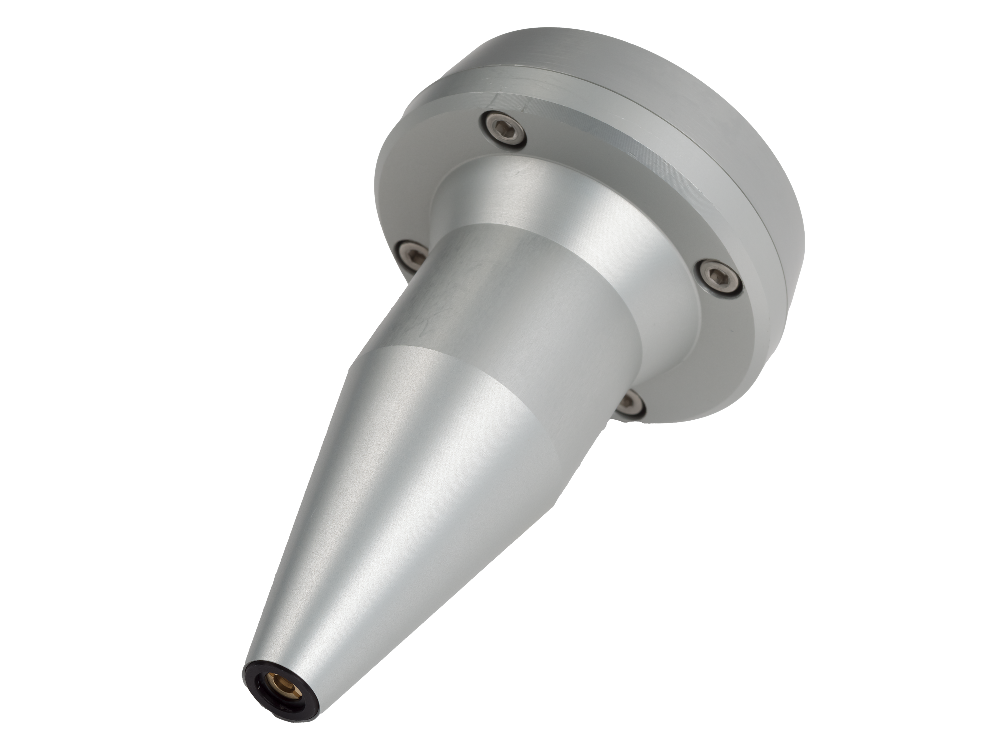
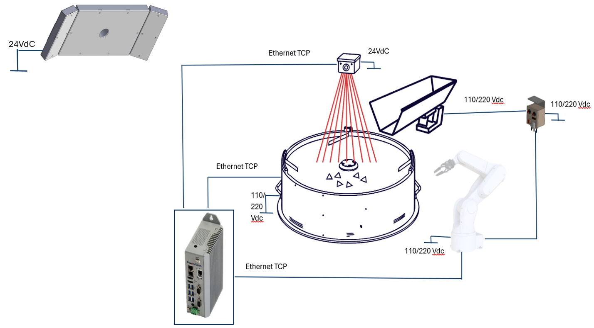

(specifiche_tecniche)=
# **Specifiche Dettagliate FlexiVision**

Questa sezione fornisce le specifiche tecniche complete del sistema FlexiVision One, inclusi dettagli su camera industriale, VisionController, griglia di calibrazione, protocolli di comunicazione e configurazioni hardware.

---
(specifiche_camera)=
## Camera 

```{figure} img/Camera2.png
:alt: Camera FlexiVision CAM-CIC-5000-20G-1
:align: center
:width: 50%
```

Il sistema FlexiVision utilizza telecamere ad alta risoluzione con interfaccia Gigabit Ethernet per garantire rapidità nell'acquisizione delle immagini e precisione nel riconoscimento dei componenti.

### Specifiche elettriche
```{list-table}
:header-rows: 1
:widths: 40 60

* - **Caratteristica**
  - **Specifiche**
* - Modello
  - CAM-CIC-5000-20G-1
* - Pixel Effettivi
  - 5 MP (2448 × 2048)
* - SNR
  - \>38 dB
* - Dynamic Range
  - 70 dB
* - GPIO
  - Connettore Hirose 6-pin: 1 ingresso opto-isolato, 1 uscita opto-isolata, 1 I/O configurabile
* - Formato Immagine
  - Mono8 / 10 / 10Packed
* - Binning 
  - Support
* - Gain
  - X1 ~ X32
* - Gamma
  - Da 0 a 4, supporto LUT
* - Tempo di Esposizione
  - 34.23 μS ~ 1S
* - Modalità Trigger
  - Software / Hardware / Free run
* - Buffer Immagine
  - 256 MB
* - impostazioni utente 
  - Support two sets of user-defined configuration
* - Alimentazione
  - 6V ~ 26V
* - Consumo Energetico
  - 12V ≈ 3.2 W
* - Attacco Obiettivo
  - C-mount
* - Temperatura Operativa
  - -30°C ~ +50°C
* - Temperatura di Stoccaggio
  - -30°C ~ +80°C
* - Certificazioni
  - CE, UL, FCC, RoHS
* - Risoluzione
  - 2448 x 2048
* - Pixel Size
  - 3.45 × 3.45 μm
* - Sensore
  - IMX264 CMOS Global Shutter
* - Dimensione Sensore
  - 2/3"
* - Frame Rate
  - 24 fps
* - Bit Depth
  - 12 bit
* - Interfaccia
  - GigE, POE
```

### Connettore GPIO (Hirose 6-pin)

```{figure} img/Pin_Cam.png
:alt: Connettore GPIO Hirose 6-pin
:align: center
:width: 70%

Vista posteriore della camera con connettori
```

```{list-table}
:header-rows: 1
:widths: 10 20 70

* - **Pin**
  - **Segnale**
  - **Descrizione**
* - 1
  - Power
  - Ingresso alimentazione DC 9V ~ 24V
* - 2
  - Line1
  - Ingresso opto-isolato
* - 3
  - Line2
  - GPIO (I/O configurabile senza opto-isolamento via software)
* - 4
  - Line0
  - Uscita opto-isolata
* - 5
  - IO GND
  - Massa opto-isolata
* - 6
  - GND
  - Massa
```

```{warning}
**Requisiti di rete obbligatori**

L'interfaccia Gigabit Ethernet è obbligatoria e richiede un'infrastruttura di rete compatibile (switch Gigabit Ethernet).

La mancata osservanza di questo requisito compromette completamente l'operatività della telecamera. Verificare che tutti i componenti di rete (cavi, switch, porte) supportino lo standard GigE.
```

### Metodi di alimentazione

```{list-table}
:header-rows: 1
:widths: 25 40 35

* - **Metodo**
  - **Descrizione**
  - **Requisiti**
* - **PoE**
  - Alimentazione e dati su un unico cavo Ethernet. Consumo circa 3.2 W.
  - Richiede PoE Injector o Switch PoE compatibile (IEEE 802.3af/at)
* - **Cavo Camera Esterno**
  - Alimentazione DC esterna tramite connettore Hirose 6-pin (6V ~ 26V). Incluso nel kit.
  - Cavo Ethernet separato necessario solo per i dati
```

```{tip}
**Quale metodo scegliere?**

- **PoE**: ideale per installazioni pulite con un solo cavo, ma richiede hardware di rete specifico
- **Alimentazione esterna**: soluzione standard più flessibile, consigliata per la maggior parte delle applicazioni
```
(cavo)=
### Cavo di Alimentazione 
```{figure} img/Cavo_Specfiche.png
:alt: Specifiche Cavo Alimentazione Camera
:align: center
:width: 100%

Specifiche Cavo Alimentazione Camera
```
```{list-table}
:widths: 30 70
:header-rows: 1

* - Parametro
  - Valore

* - **Descrizione**
  - Cavo I/O 10 metri, connettore HRS6P

* - **Product ID**
  - COG-IO-CBL-6P-10M

* - **Drawing Number**
  - 185-1252R rev. B

* - **Compatibilità**
  - Telecamere CIC-series

* - **Lunghezza**
  - 10 metri (33')

* - **Connettore (P1)**
  - Push/Pull 6P RECP Shell SZ 7 Female

* - **Sezione conduttori**
  - 22 AWG

* - **Tipo cavo**
  - Schermato, 3 coppie twistare, flessibile

* - **Colori cavi**
  - Pin 6: Bianco, Pin 1: Marrone, Pin 5: Grigio, Pin 3: Verde, Pin 2: Rosa, Pin 4: Giallo

* - **Schermatura**
  - Shield su tutti i conduttori

* - **Conformità**
  - UL/CSA e RoHS
```


### Specifiche fisiche e dimensioni
```{figure} img/dimensioni_cam.png
:alt: Dimensioni camera CAM-CIC-5000-20G-1
:align: center
:width: 100%

Dimensioni camera CAM-CIC-5000-20G-1 (mm)
```
```{list-table}
:header-rows: 1
:widths: 40 60

* - **Caratteristica**
  - **Valore**
* - Larghezza × Altezza (corpo)
  - 29 × 29 mm
* - Profondità (corpo)
  - 42.0 mm
* - Profondità totale (incluso connettore posteriore)
  - 48.9 mm
* - Sporgenza frontale (attacco obiettivo)
  - 12.60 mm
* - Interasse fori di fissaggio laterali (M2)
  - 20.0 × 23.7 mm
* - Fori di fissaggio frontali
  - 2× M2 profondità 3 mm
* - Fori di fissaggio laterali
  - 4× M2 profondità 3.5 mm + 3× M3 profondità 3.5 mm
* - Peso
  - 88 g
```
---
(specifiche_obiettivo)=
## Obiettivo
```{figure} img/Ottica_000046.png
:alt: Camera FlexiVision CAM-CIC-5000-20G-1
:align: center
:width: 50%
```

| Parametro | Ingrandimento di Riferimento | M.O.D. |
|------------|-----------------------------|--------|
| **Tipo di lente** | CCTV Lens | CCTV Lens |
| **Posizione di fuoco** | Reference Magnification | M.O.D. |
| **Ingrandimento** | 0.069 | 0.167 |
| **Lunghezza focale (mm)** | 34.97 | 34.97 |
| **Numero F (Fno)** | 2.00 ~ 16.00 | 2.00 ~ 16.00 |
| **Apertura Numerica (NA)** | - | - |
| **Distanza di lavoro / oggetto (mm)** | 500.0 / 507.0 | 200.0 / 207.0 |
| **Distanza oggetto-immagine (mm)** | 555.75 | 259.16 |
| **Lunghezza meccanica tubo (mm)** | 36.30 ~ 38.20 | 36.30 ~ 38.20 |
| **Back focus lente (mm)** | 14.75 | 18.16 |
| **Profondità di campo (mm)** | 35.476 | 6.336 |
| **Risoluzione @550nm (µm)** | - | - |
| **Posizione piano principale Ant./Post. (mm)** | 37.60 / -22.61 | 37.60 / -22.61 |
| **Posizione pupilla Entr./Usc. (mm)** | 25.22 / -41.78 | 25.22 / -41.78 |
| **Diametro pupilla Entr./Usc. (mm)** | 17.03 / 26.36 | 17.03 / 26.36 |
| **Angolo di campo (°) H × V** | 13.69 × 10.34 | 12.62 × 9.76 |
| **Distorsione TV (%)** | -0.088 | -0.142 |
| **Illuminazione relativa (%)** | 44.95 | 50.20 |
| **Peso (g)** | 50 | 50 |
| **Attacco (Mount)** | C-mount | C-mount |
| **Cerchio immagine (mm)** | φ11 | φ11 |
| **Camera massima compatibile** | 2/3" | 2/3" |
---
(specifiche_VC)=
## VisionController
```{figure} img/PC.png
:alt: VisionController FlexiVision
:align: center
:width: 50%
```

Il sistema FlexiVision opera su un PC Industriale (VisionController) che funge da controller principale per il software di visione. ARS fornisce il VisionController già pre-configurato e testato con il software FlexiVision Easy installato.

### Specifiche elettriche

```{list-table}
:header-rows: 1
:widths: 40 60

* - **Caratteristica**
  - **Specifiche**
* - CPU
  - Intel Core i3-1115G4 1.7 (4.1) GHz
* - Memoria (RAM)
  - 8G DDR4 3200 MHz
* - Archiviazione
  - 256G 
* - TPM
  - TPM 2.0
* - Sistema Operativo
  - Win11 LTSC 2024
* - Pulsante di accensione
  - Sì (pannello frontale con spia luminosa)
* - Porte Ethernet
  - **i3/i7:** 3× Gb LAN
* - Porte USB
  -  6× USB 3.0 TypeA
* - Uscita Video
  - 1× HDMI + 1× DisplayPort
* - Audio
  - Line Out + MIC (Jack 2-in-1)
* - Alimentazione (V DC)
  - 12 ~ 32 V DC
* - Temperatura Operativa
  - 1°C ~ +50°C
* - Temperatura di Stoccaggio
  - -20°C ~ +65°C
* - Umidità
  - &lt;90% (senza condensa)
* - Materiale Scocca
  - Lega di alluminio + acciaio
* - Grado di Protezione
  - IP20
* - Metodo di Installazione
  - Montaggio a parete (DIN Rail opzionale)
* - Consumo Energetico
  - 25 W
* - Dimensioni (L × A × P)
  - 59.8 × 200 × 119.5 mm
* - Peso
  - 2 kg
* - Certificazioni
  - CE, UL
```

### Porte PC
```{figure} img/Spec_Elettriche_PC.png
:alt: Schema elettrico VisionController
:align: center
:width: 50%
```


```{list-table}
:header-rows: 1
:widths: 10 25 65

* - **Ref.**
  - **Connettore**
  - **Descrizione**
* - A
  - Pulsante di accensione
  - Accensione e spegnimento del dispositivo
* - B
  - ETH 10/100/1000 Mbit – RJ45 (LAN 1)
  - Porta Ethernet Gigabit 1
* - C
  - ETH 10/100/1000 Mbit – RJ45 (LAN 2)
  - Porta Ethernet Gigabit 2
* - D
  - Porta Seriale (RS232) COM1
  - Interfaccia seriale RS232 COM1
* - E
  - Porta Seriale (RS232) COM2
  - Interfaccia seriale RS232 COM2
* - F
  - Connettore di ingresso alimentazione
  - Ingresso alimentazione 12–32V DC (terminal block 3-pin)
* - G
  - Uscita Audio + MIC (Jack 3.5 mm)
  - 1× uscita audio di linea + ingresso microfono (jack 3.5 mm)
* - H
  - 6× USB-A
  - Porte USB (USB 3.0 TypeA per versioni i3/i7)
* - I
  - Porta video 2
  - **B2B12/B2B14:** HDMI 2 — **B2B15/B2B16:** DisplayPort
* - L
  - Porta HDMI 1
  - Uscita video HDMI 1
* - M
  - ETH 10/100/1000 Mbit – RJ45 (LAN 3)
  - Porta Ethernet Gigabit 3
```
### Specifiche fisiche 

```{figure} img/dimensioni_VC.png
:alt: Dimensioni VisionController
:align: center
:width: 80%
```

```{list-table}
:header-rows: 1
:widths: 40 60

* - **Caratteristica**
  - **Valore**
* - Larghezza (totale con staffe)
  - 245.00 mm
* - Larghezza (corpo)
  - 227.00 mm
* - Larghezza pannello connettori
  - 200.00 mm
* - Altezza (totale con staffe)
  - 123.00 mm
* - Altezza (corpo)
  - 120.00 mm
* - Profondità
  - 61.10 mm
```

---
(laser)=
## Strumento Laser per Calibrazione 
Lo Strumento Laser è una soluzione avanzata per la calibrazione che migliora la precisione con cui viene salvato il punto di riferimento del robot.
Il beneficio principale del laser è che non richiede un contatto fisico con la griglia di calibrazione. Funzionando come un puntatore ad alta precisione, il laser consente all'operatore di allineare il punto target in modo visivo e ripetibile sulla griglia, offrendo un grado di accuratezza molto superiore rispetto all'uso di una punta fisica. 
Questa precisione è essenziale per il successo della calibrazione e si integra perfettamente con la ripetibilità garantita dalla Griglia di Calibrazione Dedicata ARS.


 

|Caratteristica	|Strumento Laser (Laser Tool)|	Strumento a Punta (Tip Tool) Standard |
|--|--|--|
|Metodo di Riferimento	|Non a contatto (puntatore visivo)	|A contatto (punta meccanica/fisica)|
|Precisione del Riferimento	|Massima precisione; l'operatore allinea visivamente il punto con accuratezza.	|Media, subordinata alla vista dell’operatore|
|Facilità d'Uso	|Semplifica la procedura di allineamento visivo.	|Richiede maggiore attenzione nel posizionamento e nell'evitare l'inclinazione.|
|Vantaggio Chiave	|Consente di salvare il punto di riferimento robot con la massima fedeltà possibile, essenziale per l'accuratezza finale del picking.|	Metodo base, ma meno preciso del laser.|

:::{admonition} Suggerimento 
:class: tip 
L'utilizzo dello Strumento Laser in combinazione con la Griglia di Calibrazione Dedicata ARS costituisce la metodologia più robusta e precisa per l'installazione del sistema FlexiVision
:::
---
(specifiche_griglia)=
## Griglia di calibrazione

```{figure} img/Calib_Grid.png
:alt: Griglia di Calibrazione
:align: center
:width: 50%
```


Una calibrazione eccellente è il requisito fondamentale per l'accuratezza del sistema FlexiVision. Solo una calibrazione ad alta precisione garantisce che le coordinate rilevate dalla telecamera (pixel) vengano convertite in modo accurato nelle coordinate reali del robot (millimetri), assicurando così il successo dell'applicazione di picking.

### Specifiche tecniche griglia

- Griglia per FlexiBowl 200: 
- Griglia per FlexiBowl 350: 
- Griglia per FlexiBowl 500: 
- Griglia per FlexiBowl 650: 
- Griglia per FlexiBowl 800: 
- Griglia per FlexiBowl 1200: 


Per informazioni dettagliate sulle procedure di calibrazione, consultare la sezione [Calibrazione della Camera](14_calibrazione_camera.md).

---


## Componenti opzionali 

Componenti aggiuntivi disponibili separatamente:


:::{card} Toplight
:link: toplight
:link-type: ref
:class-card: shadow
:::

:::{card} Backlight
:link: backlight
:link-type: ref
:class-card: shadow
:::


:::{card} Supporto per Camera e Toplight
:link: supporto
:link-type: ref
:class-card: shadow
:::

:::{card} Switch
:link: switch
:link-type: ref
:class-card: shadow
:::

:::{card} Display
:link: display
:link-type: ref
:class-card: shadow
:::

---

## Panoramica collegamenti



*Schema di collegamento completo del sistema FlexiVision Easy con robot e FlexiBowl*

```{list-table}
:widths: 25 25 50
:header-rows: 1

* - **Da**
  - **A**
  - **Collegamento**

* - Rete elettrica
  - FlexiBowl
  - Alimentazione 110/220 Vdc

* - Rete elettrica
  - Robot
  - Alimentazione 110/220 Vdc

* - Rete elettrica
  - Camera
  - Alimentazione 24 Vdc

* - Rete elettrica
  - Illuminatore (luce)
  - Alimentazione 24 Vdc

* - Rete elettrica
  - Controller Tramoggia
  - Alimentazione 110/220 Vdc

* - Controller Tramoggia
  - Tramoggia
  - Alimentazione e segnale

* - Robot
  - Controller Tramoggia
  - I/O Digitali

* - VisionController
  - Camera
  - Ethernet TCP

* - VisionController
  - FlexiBowl
  - Ethernet TCP

* - VisionController
  - Robot
  - Ethernet TCP
```

Per schemi elettrici dettagliati, consultare la sezione [Cablaggio e Connessioni](cablaggio).


---

