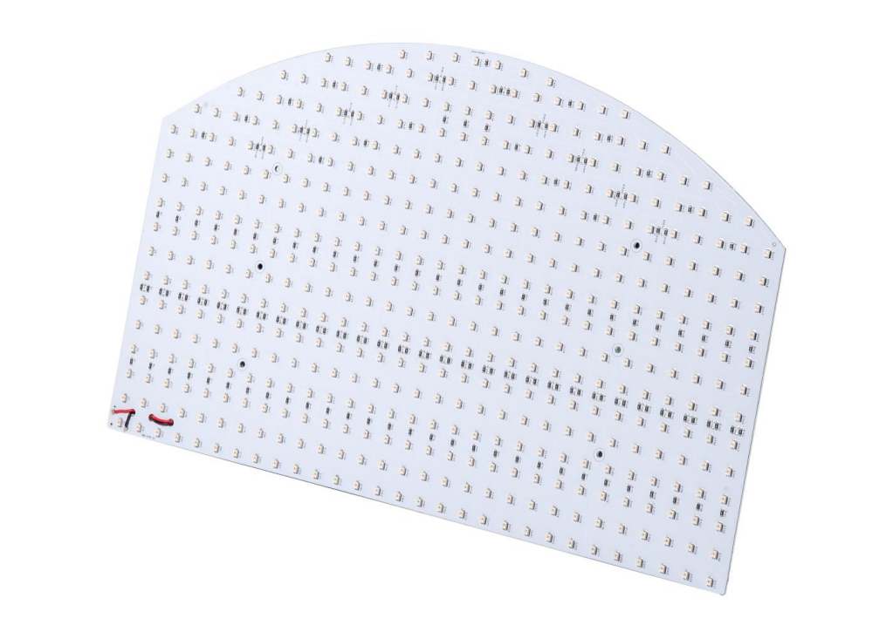
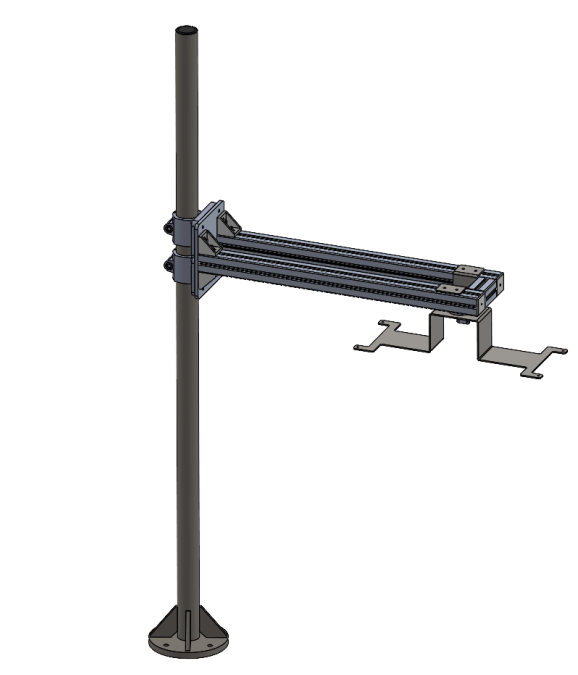

# **Opzioni**                                                                
(toplight)=
## Toplight
descrizione funzionalità toplight

le taglie disponibili sono:

```{dropdown} TopLight 500x300


| Lunghezza | Larghezza | Altezza | Altezza con piastra di fissaggio | Diametro foro centrale | Superficie utile max [AxB] | Perimetro utile max |
|--|--|--|--|--|--|--|
| **A** | **B** | **C** | **C + 10mm** | **D** | - | - |
| 500 | 300 | 45 | 55 | 65 | 0.15 m^2 | 1.6 m |

:::{list-table}
:widths: 35 65
:header-rows: 0

* - **Elettronica**
  -

* - Alimentazione
  - 24 VDC ±10%

* - Modalità di funzionamento
  - Continua o strobo

* - Ingresso strobo
  - PNP: da 5 a 24V per 100% ON. Da 0 a 1V per 100% OFF.

* - Overdrive
  - No

* - Condizioni strobo (tempo ON, duty cycle)
  - Nessuna restrizione

* - Dimmerazione
  - Pin 5 (Connettore M12 5 poli): 0–10V = 100–30% rispettivamente

* - Tempo massimo di salita
  - 15 µs

* - Tempo massimo di discesa
  - 10 µs

* - Controllo
  - Connettore M12 5 poli

* - Configurazione pin connettore
  - 1: 24VDC / 3: GND / 4: PNP

* - Consumo
  - 96.6W

* - Tensione minima di funzionamento
  - 20V sull’ingresso luce

* - Tensione nominale di funzionamento
  - 24V sull’ingresso luce (±10%)

* - Tensione massima di funzionamento
  - 30V sull’ingresso luce

* - **Meccanica**
  -

* - Spessore
  - 45mm + 10mm con piastra di fissaggio

* - Diametro interno
  - 65mm

* - Peso
  - 23.8 Kg/m² ±15%

* - Materiali
  - Alluminio e ABS caricato

* - Diffusore
  - PMMA bianco

* - Fissaggio
  - 4 dadi M4 (forniti) da inserire nella scanalatura
    oppure 4 viti M4x20 (non fornite) applicate agli angoli

* - **Ambiente**
  -

* - Temperatura di esercizio
  - -10°C a +40°C / 80% di umidità senza condensa
    Nessuno shock termico (variazione massima: 10°C in 24h)

* - Temperatura di stoccaggio
  - -20°C a +60°C / 80% di umidità senza condensa
    Nessuno shock termico (variazione massima: 10°C in 24h)

* - Grado di protezione IP
  - IP 50

* - Marcature
  - RoHS-CE-DEEE
:::

```

```{dropdown} TopLight 700x300


| Lunghezza | Larghezza | Altezza | Altezza con piastra di fissaggio | Diametro foro centrale | Superficie utile max [AxB] | Perimetro utile max |
|--|--|--|--|--|--|--|
| **A** | **B** | **C** | **C + 10mm** | **D** | - | - |
| 700 | 300 | 45 | 55 | 65 | 0.21 m^2 | 2 m |

:::{list-table}
:widths: 35 65
:header-rows: 0

* - **Elettronica**
  -

* - Alimentazione
  - 24 VDC ±10%

* - Modalità di funzionamento
  - Continua o strobo

* - Ingresso strobo
  - PNP: da 5 a 24V per 100% ON. Da 0 a 1V per 100% OFF.

* - Overdrive
  - No

* - Condizioni strobo (tempo ON, duty cycle)
  - Nessuna restrizione

* - Dimmerazione
  - Pin 5 (Connettore M12 5 poli): 0–10V = 100–30% rispettivamente

* - Tempo massimo di salita
  - 15 µs

* - Tempo massimo di discesa
  - 10 µs

* - Controllo
  - Connettore M12 5 poli

* - Configurazione pin connettore
  - 1: 24VDC / 3: GND / 4: PNP

* - Consumo
  - 135.6W

* - Tensione minima di funzionamento
  - 20V sull’ingresso luce

* - Tensione nominale di funzionamento
  - 24V sull’ingresso luce (±10%)

* - Tensione massima di funzionamento
  - 30V sull’ingresso luce

* - **Meccanica**
  -

* - Spessore
  - 45mm + 10mm con piastra di fissaggio

* - Diametro interno
  - 65mm

* - Peso
  - 23.8 Kg/m² ±15%

* - Materiali
  - Alluminio e ABS caricato

* - Diffusore
  - PMMA bianco

* - Fissaggio
  - 4 dadi M4 (forniti) da inserire nella scanalatura
    oppure 4 viti M4x20 (non fornite) applicate agli angoli

* - **Ambiente**
  -

* - Temperatura di esercizio
  - -10°C a +40°C / 80% di umidità senza condensa
    Nessuno shock termico (variazione massima: 10°C in 24h)

* - Temperatura di stoccaggio
  - -20°C a +60°C / 80% di umidità senza condensa
    Nessuno shock termico (variazione massima: 10°C in 24h)

* - Grado di protezione IP
  - IP 50

* - Marcature
  - RoHS-CE-DEEE
:::
```

```{dropdown} TopLight 700x500


| Lunghezza | Larghezza | Altezza | Altezza con piastra di fissaggio | Diametro foro centrale | Superficie utile max [AxB] | Perimetro utile max |
|--|--|--|--|--|--|--|
| **A** | **B** | **C** | **C + 10mm** | **D** | - | - |
| 700 | 500 | 45 | 55 | 65 | 0.35 m^2 | 2.4 m |

:::{list-table}
:widths: 35 65
:header-rows: 0

* - **Elettronica**
  -

* - Alimentazione
  - 24 VDC ±10%

* - Modalità di funzionamento
  - Continua o strobo

* - Ingresso strobo
  - PNP: da 5 a 24V per 100% ON. Da 0 a 1V per 100% OFF.

* - Overdrive
  - No

* - Condizioni strobo (tempo ON, duty cycle)
  - Nessuna restrizione

* - Dimmerazione
  - Pin 5 (Connettore M12 5 poli): 0–10V = 100–30% rispettivamente

* - Tempo massimo di salita
  - 15 µs

* - Tempo massimo di discesa
  - 10 µs

* - Controllo
  - Connettore M12 5 poli

* - Configurazione pin connettore
  - 1: 24VDC / 3: GND / 4: PNP

* - Consumo
  - 252.6W

* - Tensione minima di funzionamento
  - 20V sull’ingresso luce

* - Tensione nominale di funzionamento
  - 24V sull’ingresso luce (±10%)

* - Tensione massima di funzionamento
  - 30V sull’ingresso luce

* - **Meccanica**
  -

* - Spessore
  - 45mm + 10mm con piastra di fissaggio

* - Diametro interno
  - 65mm

* - Peso
  - 23.8 Kg/m² ±15%

* - Materiali
  - Alluminio e ABS caricato

* - Diffusore
  - PMMA bianco

* - Fissaggio
  - 4 dadi M4 (forniti) da inserire nella scanalatura
    oppure 4 viti M4x20 (non fornite) applicate agli angoli

* - **Ambiente**
  -

* - Temperatura di esercizio
  - -10°C a +40°C / 80% di umidità senza condensa
    Nessuno shock termico (variazione massima: 10°C in 24h)

* - Temperatura di stoccaggio
  - -20°C a +60°C / 80% di umidità senza condensa
    Nessuno shock termico (variazione massima: 10°C in 24h)

* - Grado di protezione IP
  - IP 50

* - Marcature
  - RoHS-CE-DEEE
:::
```

```{dropdown} TopLight 900x600


| Lunghezza | Larghezza | Altezza | Altezza con piastra di fissaggio | Diametro foro centrale | Superficie utile max [AxB] | Perimetro utile max |
|--|--|--|--|--|--|--|
| **A** | **B** | **C** | **C + 10mm** | **D** | - | - |
| 900 | 600 | 45 | 55 | 65 | 0.54 m^2 | 3 m |

:::{list-table}
:widths: 35 65
:header-rows: 0

* - **Elettronica**
  -

* - Alimentazione
  - 24 VDC ±10%

* - Modalità di funzionamento
  - Continua o strobo

* - Ingresso strobo
  - PNP: da 5 a 24V per 100% ON. Da 0 a 1V per 100% OFF.

* - Overdrive
  - No

* - Condizioni strobo (tempo ON, duty cycle)
  - Nessuna restrizione

* - Dimmerazione
  - Pin 5 (Connettore M12 5 poli): 0–10V = 100–30% rispettivamente

* - Tempo massimo di salita
  - 15 µs

* - Tempo massimo di discesa
  - 10 µs

* - Controllo
  - Connettore M12 5 poli

* - Configurazione pin connettore
  - 1: 24VDC / 3: GND / 4: PNP

* - Consumo
  - 345.6W

* - Tensione minima di funzionamento
  - 20V sull’ingresso luce

* - Tensione nominale di funzionamento
  - 24V sull’ingresso luce (±10%)

* - Tensione massima di funzionamento
  - 30V sull’ingresso luce

* - **Meccanica**
  -

* - Spessore
  - 45mm + 10mm con piastra di fissaggio

* - Diametro interno
  - 65mm

* - Peso
  - 23.8 Kg/m² ±15%

* - Materiali
  - Alluminio e ABS caricato

* - Diffusore
  - PMMA bianco

* - Fissaggio
  - 4 dadi M4 (forniti) da inserire nella scanalatura
    oppure 4 viti M4x20 (non fornite) applicate agli angoli

* - **Ambiente**
  -

* - Temperatura di esercizio
  - -10°C a +40°C / 80% di umidità senza condensa
    Nessuno shock termico (variazione massima: 10°C in 24h)

* - Temperatura di stoccaggio
  - -20°C a +60°C / 80% di umidità senza condensa
    Nessuno shock termico (variazione massima: 10°C in 24h)

* - Grado di protezione IP
  - IP 50

* - Marcature
  - RoHS-CE-DEEE
:::
```

(backlight)=
## Backlight
descrizione funzionalità backlight

```{dropdown} Backlight per FB200


| Articoli | CE000351 | CE000353 | CE000331 |
|--|--|--|--|
| Colore LED | rosso | infrarosso | bianco |
| Lunghezza d’onda | 630 nm | 850 nm | N/D |
| Tensione | 24VDC | 24VDC | 24VDC |
| Corrente | 0.17A | 0.12A | 0.17A |
| Area di illuminazione | 155x75 mm^2 |  |  |
| Materiale struttura | Lega di alluminio |  |  |
| Temperatura di esercizio | -40 / +85 °C |  |  |
| Lunghezza cavo | 0.2 m |  |  |
| Metodo di raffreddamento | Aria naturale |  |  |
| Materiale opalino | Metacrilato bianco opalino |  |  |
```
```{dropdown} Backlight per FB350


| Articoli | CE000342 | CE000275 | CE000341 |
|--|--|--|--|
| Colore LED | rosso | infrarosso | bianco |
| Lunghezza d’onda | 630 nm | 850 nm | N/D |
| Tensione | 24VDC | 24VDC | 24VDC |
| Corrente | 0.18A | 0.13A | 0.18A |
| Area di illuminazione | 220x100 mm^2 |  |  |
| Materiale struttura | Lega di alluminio |  |  |
| Temperatura di esercizio | -40 / +85 °C |  |  |
| Lunghezza cavo | 0.2 m |  |  |
| Metodo di raffreddamento | Aria naturale |  |  |
| Materiale opalino | Metacrilato bianco opalino |  |  |
```
```{dropdown} Backlight per FB500


| Articoli | CE000344 | CE000272 | CE000343 |
|--|--|--|--|
| Colore LED | rosso | infrarosso | bianco |
| Lunghezza d’onda | 630 nm | 850 nm | N/D |
| Tensione | 24VDC | 24VDC | 24VDC |
| Corrente | 0.46A | 0.31A | 0.46A |
| Area di illuminazione | 330x170 mm^2 |  |  |
| Materiale struttura | Lega di alluminio |  |  |
| Temperatura di esercizio | -40 / +85 °C |  |  |
| Lunghezza cavo | 0.2 m |  |  |
| Metodo di raffreddamento | Aria naturale |  |  |
| Materiale opalino | Metacrilato bianco opalino |  |  |
```
```{dropdown} Backlight per FB650



| Articoli | CE000306 | CE000273 | CE000305 |
|--|--|--|--|
| Articoli alternativi | GM000591 | GM000592 | GM000590 |
| Colore LED | rosso | infrarosso | bianco |
| Lunghezza d’onda | 630 nm | 850 nm | N/D |
| Tensione | 24VDC | 24VDC | 24VDC |
| Corrente | 0.86A | 0.56A | 0.94A |
| Area di illuminazione | 400x240 mm^2 |  |  |
| Materiale struttura | Lega di alluminio |  |  |
| Temperatura di esercizio | -40 / +85 °C |  |  |
| Lunghezza cavo | 0.2 m |  |  |
| Metodo di raffreddamento | Aria naturale |  |  |
| Materiale opalino | Metacrilato bianco opalino |  |  |
```
```{dropdown} Backlight per FB800


| Articoli | CE000345 | CE000274 | CE000346 |
|--|--|--|--|
| Colore LED | rosso | infrarosso | bianco |
| Lunghezza d’onda | 630 nm | 850 nm | N/D |
| Tensione | 24VDC | 24VDC | 24VDC |
| Corrente | 1.15A | 0.76A | 1.2A |
| Area di illuminazione | 400x315 mm^2 |  |  |
| Materiale struttura | Lega di alluminio |  |  |
| Temperatura di esercizio | -40 / +85 °C |  |  |
| Lunghezza cavo | 0.2 m |  |  |
| Metodo di raffreddamento | Aria naturale |  |  |
| Materiale opalino | Metacrilato bianco opalino |  |  |
```
```{dropdown} Backlight per FB1200


| Articoli | GE000051 | GE000052 | GE000050 |
|--|--|--|--|
| Colore LED | rosso | infrarosso | bianco |
| Lunghezza d’onda | 630 nm | 850 nm | N/D |
| Tensione | 24VDC | 24VDC | 24VDC |
| Corrente | 4A | 2.6A | 4.2A |
| Area di illuminazione | 917x525 mm^2 |  |  |
| Materiale struttura | Lega di alluminio |  |  |
| Temperatura di esercizio | -40 / +85 °C |  |  |
| Lunghezza cavo | 0.2 m |  |  |
| Metodo di raffreddamento | Aria naturale |  |  |
| Materiale opalino | Metacrilato bianco opalino |  |  |
```

#  backlight a toplight?

```{warning}
**Impatto sul riconoscimento pezzi**

La scelta tra backlight e toplight influenza significativamente il riconoscimento:

- **Backlight**: Ottimo per profili/sagome, pezzi appaiono come silhouette scure su sfondo chiaro
- **Toplight**: Necessario per riconoscere dettagli superficiali, texture, feature interne

La calibrazione deve essere eseguita con lo stesso tipo di illuminazione che verrà utilizzato durante il picking in produzione.
```
---
(filtroIR)=
## Filtro IR


---
(supporto)=
## Supporto per Camera e Toplight
descrizione funzionalità



| Voce | GM000632 |
| -- | -- |
| Compatibilità | Camera e Toplight 200/350/500 – Toplight XL 650/800 – Toplight XXL 650/800 |
| Intervallo posizionamento verticale (centro staffa camera dalla flangia base) | da 300 mm a 1300 mm |
| Intervallo posizionamento radiale (centro staffa camera dal centro palo) | da 150 mm a 650 mm |
| Peso | 14 kg |
| Materiali | Palo in acciaio inox + profili in alluminio per struttura di supporto toplight e camera |
| Predisposizione fissaggio | N°4 viti M10 su diametro Ø140 mm |

(switch)=
## Switch

(display)=
## Display Touch Screen

### Specifiche Elettriche

|  |  |
|--|--|
| Touch Screen | Capacitivo |
| Ingressi video | 1x VGA – 1x DP – 1x DVI-D |
| Alimentazione | 12–32 Vdc (Assorbimento 30W) |
| Montaggio | Da pannello (Panel Mount) |

### Specifiche Fisiche

|  |  |
|--|--|
| Peso | 7 kg |
| Protezione frontale | IP66 |
| Temperatura operativa | 0 .. +50 °C |
| Temperatura di stoccaggio | -20 .. +65 °C |
| Umidità | < 90% senza condensa |
| Certificazione | CE |

## Ring Light

| Parametro | Valore |
|------------|---------|
| **Colore LED** | Bianco |
| **Tensione** | 24 VDC |
| **Consumo di potenza** | 16 W max |
| **Materiale del corpo** | Lega di alluminio, Resina |
| **Temperatura di esercizio** | da 0 a +40 °C |
| **Lunghezza cavo** | 0,3 m |
| **Metodo di raffreddamento** | Aria naturale |